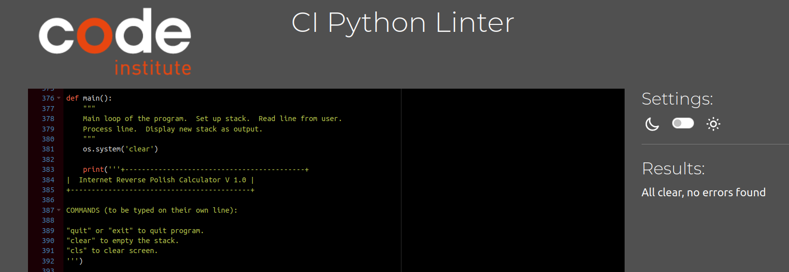

# Online Reverse Polish Notation (RPN) Calculator

Live site: https://reverse-polish-calculator.herokuapp.com/

Github repository:
https://github.com/the-blackhall-projects/reverse-polish-calculator

PyDoc Documentation:
https://the-blackhall-projects.github.io/reverse-polish-calculator/

## What is Reverse Polish Notation?

This program implements a Reverse Rolish Notation (RPN) calculator.  Reverse Polish is an alternative to the more common infix notation involving parentheses. Wheras with normal infix notation, the operator is placed between the operands, with RPN the operator comes after the operands.  As such, it is an example of postfix notation.

So, for example, instead of writing:

(2 + 4) * 5 

in normal infix notation, in RPN we would write:

2 4 + 5 *

In this example, 2 and 4 are pushed onto the stack.  The '+' operator
is invoked replacing the 2 and 4 with the sum 6.  Then a 5 is pushed onto
the stack and the multiplaction operator '*' is invoked giving the final result of 30.  

RPN has a long history and is a variant of Polish Notation (PN) which was invented by the Polish logician, Jan Łukasiewicz to express mathematical logic without parentheses.  While PN puts the operator in front of the operands, RPN puts the operator after and hence is a postfix notation.

RPN was used in some early digital computers such as Konrad Zuse's Z3, English Electric's KDF9 and the Burroughs B5000.  The early computer language GEORGE used RPN to express arithmetic and ran on English Electric's DEUCE machine.

More recently, FORTH, a stack based language developed in 1970, uses RPN for arithmetic and Hewlett-Packard, to this day, allows the use of RPN in its calculators.  


## Using the program

When you start up the program you are presented with the following information:

``` 
+-------------------------------------------+
|  Internet Reverse Polish Calculator V 1.0 |
+-------------------------------------------+

COMMANDS (to be typed on their own line):

"quit" or "exit" to quit program.
"clear" to empty the stack.
"cls" to clear screen.

Stack: (empty)
RPN > 
```
After the main banner we have a list of commands which must be entered alone
on their own line to work.  The result of these commands should be obvious from the opening text.

Following this we have a display of the data stack.  As we can see, upon starting the program, the stack is empty.
Finallly, on the next line, we have the "RPN >" prompt after which the user 
can type expressions in Reverse Polish Notation (RPN).

RPN is a sequences of tokens separated by spaces.  The tokens can be of three
types:

1. Commands
1. Numbers
1. Operators
1. Functions

**Commands** have already been discussed.  They are not part of RPN and therefore must be typed on their own line. 

**Numbers** can be positive or negative and can be entered in scientific notation.  When a number is encountered in the input line it is added to the stack. 
```
Stack: (empty)
RPN > 1 -1.2 3e-3
Stack: 1 -1.2 0.003
RPN > 
```
In the example above, starting from an empty stack, the numbers 1, -1.2 and 3e-3 are entered after the prompt.  The program then displays the stack and a new
prompt is printed on the following line.

**Operators** consist of the standard arithemtic binary operators.  Unlike conventional notation, operators appear after their operands in the command line.  When an operator is encountered, two numbers are popped from the stack.  The operation is peformed upon them, and the result then pushed to the stack.

Below is a table of available operators.

| Operator      | Description |
| ----------- | ----------- |
| +      | Addition       |
| -   | Subtraction        |
| \*   | Multipliacation   |
|\\   | Division        |
|^   | Exponentiation     |
|MOD   | Modulus     |

All of these require at least two numbers on the stack upon which to operate.

Example:

To compute 6 × (5 + 4) we would type: 5 4 + 6 *.

```
Stack: (empty)
RPN > 5 4 + 6 *
Stack: 54
RPN > 
```
And we see the answer is 54.

**Functions** come in several types. 
- Trigonometric
- Log and Exponential
- Stack manipulation
- Other functions

Most functions take one argument.  When a single argument is encountered
in the input line, a number is popped off the stack, the function is 
evaluated and the result pushed back onto the stack.

| Trigonometric      | Description |
| ----------- | ----------- |
| SIN      | Sine       |
| COS   | Cosine        |
| TAN   | Tangent   |
| ATN   | Arctangent        |
| COT   | Cotangent        |

| Log and Exponential      | Description |
| ----------- | ----------- |
| LOG      | Natural logarithm       |
| EXP   | Exponent to base e        |

| Stack manipulation      | Description |
| ----------- | ----------- |
| DUP      | Duplicate top item |
| DROP   | Drop top item       |
| SWP   | Swap top two items       |

| Other functions      | Description |
| ----------- | ----------- |
| SQR   | Square root   |
| ABS   | Absolute value   |
| INT      | Integer portion of num |
| SGN   | Sign of a number 1, -1 or 0 |
| NEG   | Negate: multiply by -1   |
| INV   | Invert: 1 / num   |

As an example, consider $\sin\left(\pi/2\right)$. In the RPN calculator we would write:

```
Stack: (empty)
RPN > pi 2 / sin
Stack: 1
RPN >
```
Here, $\pi$ and 2 are pushed to the the stack.  Then
the division operator / is invoked and finally the $\sin$ of the result is calculated. 

Input can be continued over several lines.  This is useful if you wish to see intermediate results
before continuing with the rest of the input.

Continuing with the previous example:

```
Stack: (empty)pa
RPN > pi 2 /
Stack: 1.5707963267948966
RPN > sin
Stack: 1
RPN > 
```
In the example above, $\pi$ is first divided by 2 and the result displayed as 1.5707... when the return key is pressed.  On the next line, sin is entered and the resulting 1 is shown.

Since not everything typed into the input line will be valid, the program tries to catch errors
as they occur. 
```
Stack: (empty)
RPN > 3 4 eee 1 4 +
EEE not found. Rest of input line ignored.
Stack: 3 4
RPN > 
```
In the above example, the token "eee" is not a valid function
and so produces an error.  Note that not only is the token itself
rejected but the rest of the line is also ignored.  The reason 
for this is that a misspelled function can have a profound effect
on any subsequent results.  Therefore it is better that the error
itself is first corrected before the user proceeds with the rest
of the calculation.

For this reason, it is recommended that long expressions be
entered in small chunks thus minimizing the amount of discarded information due to errors.

## Features

- Stack based data model using a python list encapsulated in a class.
- Exception handling used to propagate input errors up the call
heirarchy to the user.
- Only valid tokens: numbers, functions or operators can be entered.  Error message is displayed if otherwise.
- Error message also displayed if data is invalid for function or 
operagor.  E.g. dividing by zero or taking the log of a negative number.
- Custom error messages where anticipated.  However in unknown cases, the built in Python message may be displayed.  
- Only highest level performs input and output.  Lower level functions perform atomic, appropriately granular operations minimizing side-effects.
- Global variables have been avoided.
- Code in "snake_case" except for class names which are in CamelCase. 
- Code conforms to PEP8 standards.
- OOP has been used where appropriate to represent stack class.


## Testing.
- Code was passed through a PEP8 linter.  
- Specific cases were tested:
	* Empty input - the program simply reprints the promtp as intended.
	* Invalid token - the program rejects the tokan and ignores rest of input line, as intended.
	* Invalid data for function or operator.  Certain functions like SQR, LOG, COT have defined argument ranges.  For example, SQR can't take a negative number.  Various invalid arguments were tried and the program prints a friendly error message, rejects the function and remaining line, as intended.
	* Division by zero in / or MOD operators.  If this happens, an error is displayed, the operator is rejected and rest of input line ignored, as intended.
	* Insufficient arguments in stack for operator or function.  If an operator requires two operands and only one is present in the stack, the program rejects the operator and ignores rest of line as intended.
	* Commands, cls, clear, exit and quit were tested and work as
	intended.


PEP8 Linter:




